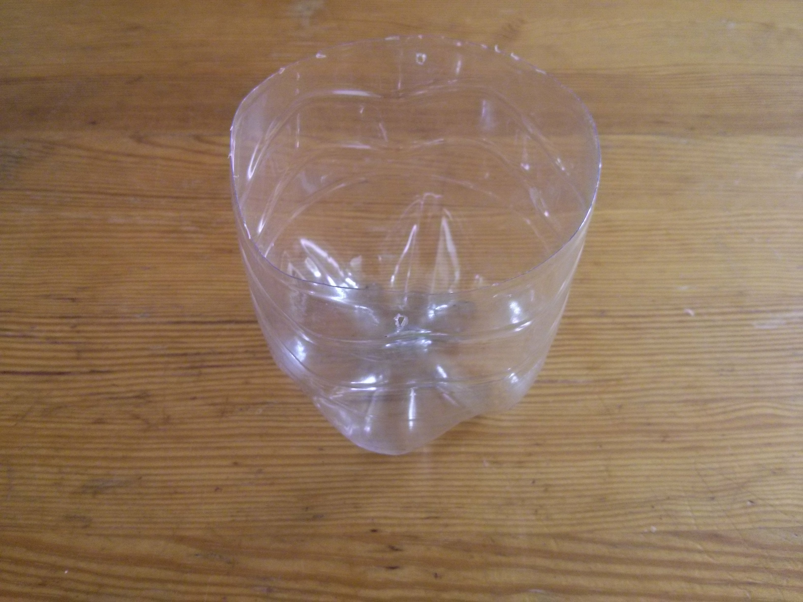
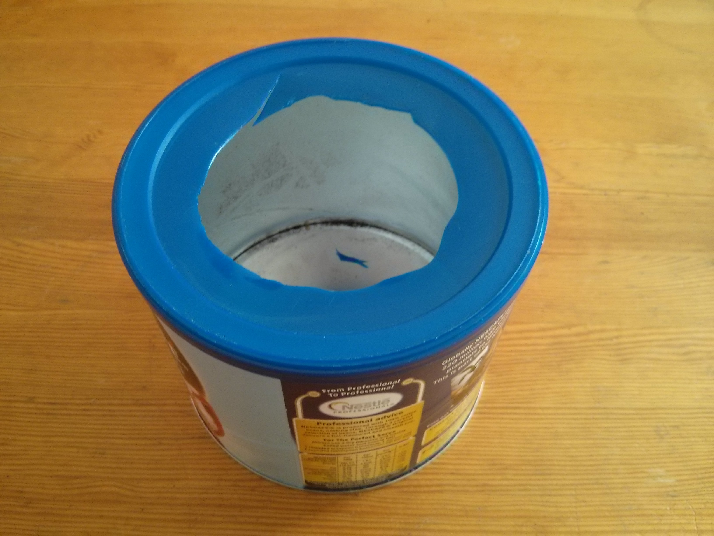
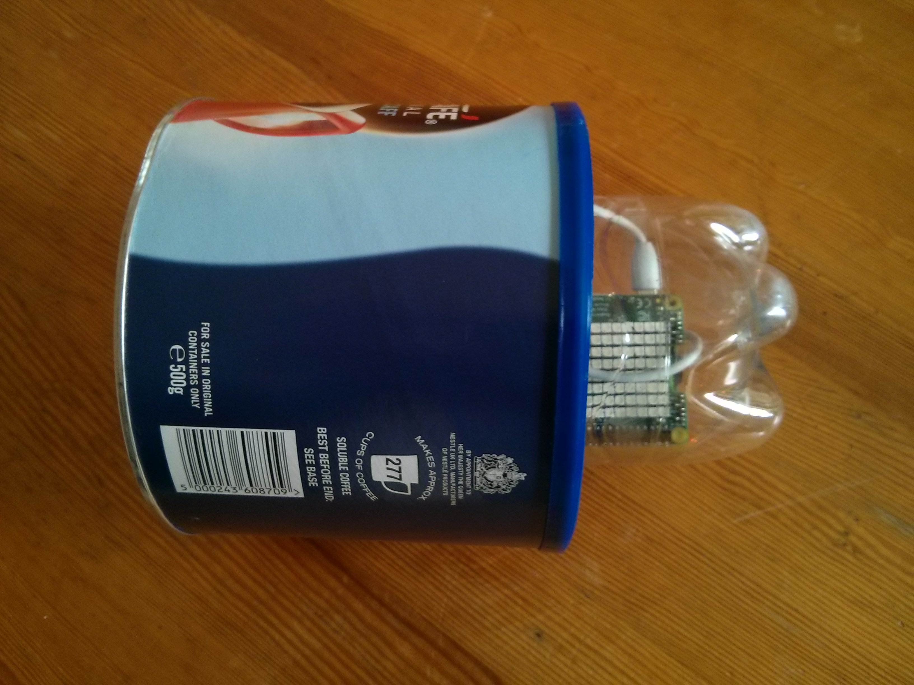
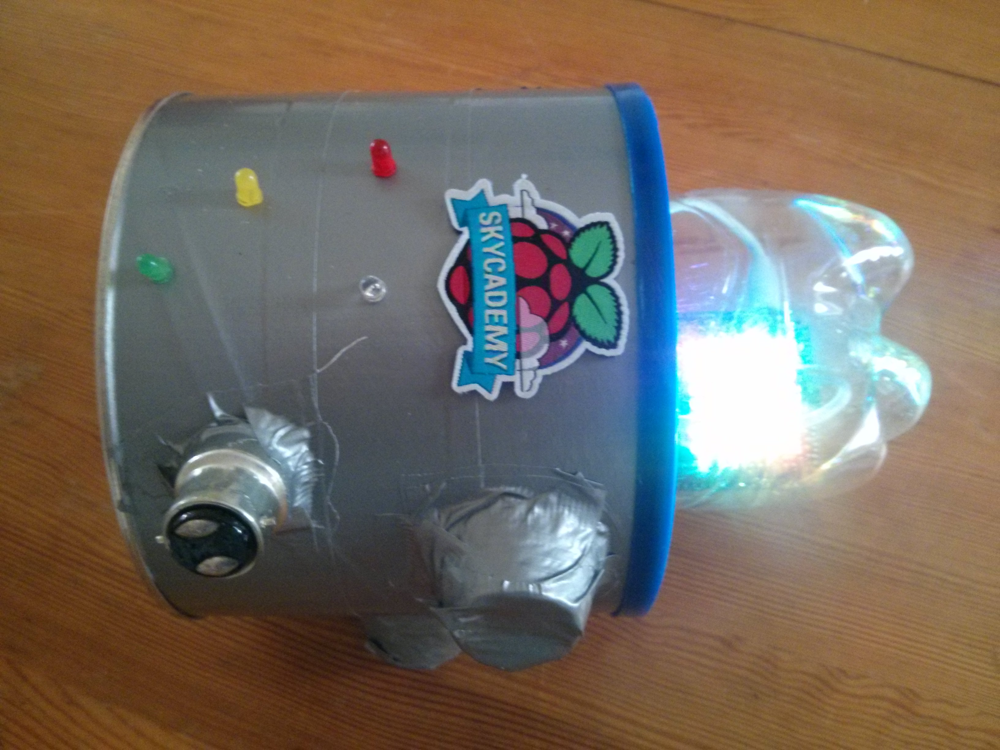

# Sensing Space Lesson Plan 1 - Building your model ISS

In this lesson, students will build a model Internation Space Station, containing a Sense Hat.

## Learning objectives

- Understand the basic modular structure of the ISS

## Learning outcomes

### All students are able to

- Understand that the ISS is composed of several different modules and has been expanded upon since its launch in 1998.

### Most students are able to

- Appreciate that the different parts of the ISS are made by different countires and serve different purposes.

### Some students are able to

- Recall the names of parts of the ISS and their functions.

## Lesson Summary

- Students will research, design and construct a module of the ISS in groups, that can be joined together to form a complete space station.

## Starter

- Show students the interactive 3D model of the ISS at [heavens above](http://www.heavens-above.com/ISS_3D.aspx). It looks really nice when projected in full-screen mode.
- Ask the students what the 3D model represents.
- Rotate and zoom in and out of the model, and ask them if they can guess what the different sections of the ISS do.
- Explain to the students that there are two Raspberry Pis on the ISS, as part of the Astro Pi project, and that they're going to be conducting some experiments using a model ISS to learn about what it's like living in Space.

## Main development

1. Split the class into appropriately sized groups, and assign each group a pressurised module or modules to construct.
  1. Zarya
  2. Unity
  3. Zvezda
  4. Destiny
  5. Quest
  6. Pirs and Poisk
  7. Harmony
  8. Columbus
  9. Kibō
  10. Rassvet
  11. Leonardo
  12. Truss and Photovoltaic Arrays

1. Their first task will to be conduct some research on their module and find out what it does, when it was launched and who it was made by. This may be best provided as a homework task before the project begins.

2. No guides have been provided on the construction of the modules themselves. You should incourage your students to use a range of materials and be as creative as possible. Ensue that you give them approximate dimension for the construction, as you are going to have to join them together at the end.

3. The Tranquility module and Cupola has been left out of the list. This is going to be yours to make. Follow the simple guide below to produce the Tranquility module containing the Sense HAT.

4. Once all the modules have been constructed, bring them together as a class and join them together to form the completed ISS.

## Building the Tranquility Module
1. There will be 2 Raspberry Pis and Sense HATs aboard the ISS. One will be situated in the Cupola which is attached to the Tranquility module.

1. If you build the Cupola and the Tranquility module first, you will have some idea of the scale of the other modules, your students will need to conform to.
2. You can build the housing for the Sense Hat anyway you choose, but you will need to make sure that it is sealed reasonably well, and that there is transparent base. The following construction guide works well enough

### Recommended equipment.

You can make the Tranquility module and Cupola in anyway you like, so long as the Cupola is large enough to house a Raspberry Pi and Sense HAT and battery.

1. Round bottomed 2L empty water bottle.
1. Large Coffee Can
1. 

### Instructions
1. Cut the water bottle in half, using a sharp knife. Ensure the inside is dry.

1. Cut a hole in the top of the lid of the coffee can, large enough to accept the plastic bottle. (Note - this is not the current configuration of the Cupola)

1. Push the plastic bottle through the hole in the lid.

1. Decorate the Module.

## Plenary

Once the model has been assembled, have each group talk about the module they have created, and present to the class its function.

## Homework
- Possible research on modules to be constructed as detailed above.
