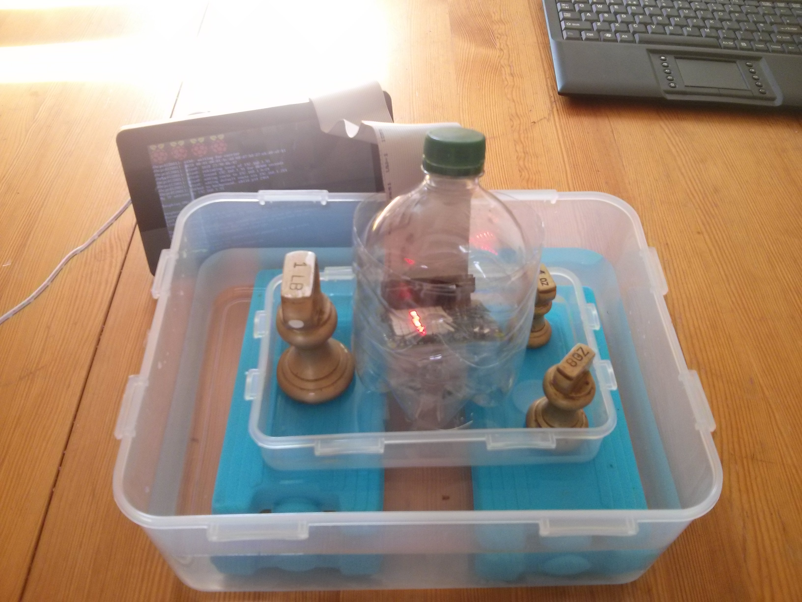
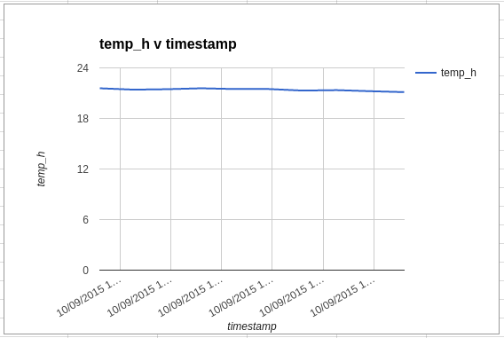
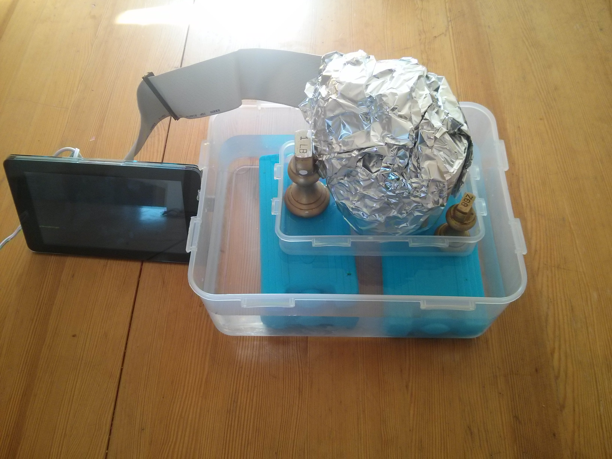
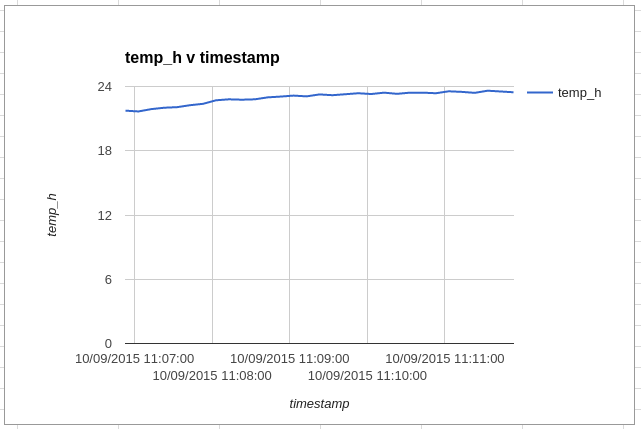

# Sensing Space 2 - Avoiding Sweaty Astronauts

In this lesson, students will learn about the range of temperatures that the ISS needs to protect astronauts from, and the methods used to regulate the temperature aboard the ISS.

## Learning objectives

- Understand that in space, astronauts can be exposed to very high and very low temperatures.
- Understand how reflective surfaces and insulation can help to control the temperature.

## Learning outcomes

### All students are able to

- Plot simple temperature graphs using data from the Sense HAT.
- Understand the need to keep temperatures constant on the ISS.

### Most students are able to

- Make predictions regarding the effect of different material coverings on the temperature.
- Use and understand the terms insulator and reflection.

### Some students are able to

- Describe how heat is transferred through a vacuum in space.
- Plan experiments to further investigate heating and cooling.

## Lesson Summary

- Students will start by learning about the extremes of temperature experienced in space, and understand how the Earth's atmosphere protects us from these temperatures.
- Students will learn how insulation is used on the ISS to help protect from the extremes of temperature.
- Students will conduct experiments with different material coverings of their ISS model, make predictions about how this will effect the internal temperature of the ISS, and use data from the Sense HAT to graph the results.

## Starter

1. Begin by asking your students what they think the dangers are to astronauts living on the ISS.
1. Ask your students to guess what temperature they think it is outside of the ISS. If they're unsure of the range of temperatures, then this table can be displayed to give them some guidance.

| Place              | Temperature (Celsius)  |
|:-------------------|:----------------------:|
| Deep Space         | -270                   |
| Earth Average      | 15                     |
| Surface of the Sun | 6051                   |

1. Explain that temperatures can be as high as 121 C on the sunny side of the ISS and as low as -157 C on the dark side.
1. Exposure to both extremes of temperatures would kill a human pretty quickly.
1. Explain that humans are only capable of living in temperatures ranging between 4 and 35 degrees for long periods of time, without taking special precautions (such as wearing **lots** of clothes or drinking **huge** volumes of water.
1. Ask students what they think keeps the Earth from getting too hot or too cold.
1. Explain that the Earth's atmosphere acts like a blanket around he Earth, keeping heat in on the dark side and reflecting some heat away on the light side.

## Main development

### The Data Logger

To begin with it is a good idea to familiarise your students with using the CSV file produced by the Sense-Logger.py program.

1. To access the resources for this and future lessons, open a LXTerminal and type:

```bash
git clone https://github.com/raspberrypilearning/sensing-space.git && cd ~/sensing-space/lesson-2/code
```
		
1. You'll need to install a dependency for the Sense HAT logging program you are going to use.

```bash
sudo pip-3.2 install evdev
```
		
1. The Sense-Logger.py program records lots of data, but to begin with you only want to record temperature. You'll need to edit the file. Open up IDLE for Python 3


1. Click `File` and `Open` and then choose the `Sensing-Space/lesson-2/code/Sense-Logger.py` file that you've just downloaded.

1. Find the following lines near the top of the file.

```python
## Logging Settings
TEMPERATURE=True
HUMIDITY=True
PRESSURE=True
ORIENTATION=True
ACCELERATION=True
MAG=True
GYRO=True
DELAY = 0
BASENAME = ""
```

1. We only want to only record temperature every 5 seconds, so edit the lines so they look like this.

```python
## Logging Settings
TEMPERATURE=True
HUMIDITY=False
PRESSURE=False
ORIENTATION=False
ACCELERATION=False
MAG=False
GYRO=False
DELAY = 5
BASENAME = "temp"
```

1. Now run the Sense-Logger.py file by saving and pressing `F5` on our keyboard. A red exclamation mark should be displayed on the LED matrix. Pull the joystick downwards to start logging, and then upwards when you have finished.

1. You now need to share the file with your students. It is best to rename the file first. Don't forget you can use the `Tab` key to auto-complete file names once you've started typing them.

```bash
mv temp-long-sting-of-numbers.csv temp.csv
```

1. Use [this guide](link to guides) to share the CSV file with your students.

1. Your students can follow the instructions in their worksheet to produce a graph of the CSV file using Google Sheets. You can amend the instructions if you wish to use a different Spreadsheet application.

### Keeping the astronauts warm

1. Explain that the ISS needs to make sure that the astronauts don't get too cold.

1. Ask students to think of ways in which the engineers that designed the ISS could ensure that the astronauts stay warm. Two possible ideas that can be easily investigated are:
  1. Heating the ISS
  1. Insulating the ISS

1. Show the students the LED matrix on the Sense HAT. Have the students make a prediction as to what will happen to the temperature inside the Cupola if all the LEDS are illuminated.

1. You'll need to edit the Sense-Logger.py file to turn on all the LEDs. Change the lines below.

```python
def show_state(logging):
	if logging:
		sense.show_letter("!",text_colour=[0,255,0])
	else:
		sense.show_letter("!",text_colour=[255,0,0])
```

to

```python
def show_state(logging):
	if logging:
		sense.clear(255,255,255)
		#sense.show_letter("!",text_colour=[0,255,0])
	else:
	sense.show_letter("!",text_colour=[255,0,0])
```

1. We'll also need to simulate the cold environment of space, so that we get some heat loss from the Cupola. For this we can use an ice-bath. Set up your Raspberry Pi and Sense Hat as shown in the image below, using ice or freezer-blocks.



1. Use the joystick to initiate logging and then seal your Cupola.

1. After a few minutes, stop the logging and share the CSV file with your students.

1. Students should follow the worksheet guide to produce a graph of the data, and explain what is happening.

1. The graph should show a steady loss in temperature as shown below.



### Using insulation
1. Explain that simply heating the ISS isn't enough, as heat can quickly escape into the vacuum of space.

1. Have students suggest materials that the ISS could be coated in that might help keep heat in.

1. Have ready some materials that you can wrap your Tranquillity module in. Some suggestions could be:
  1. Silver Foil
  2. Bubble wrap
  3. Black paper
  4. Fabric


1. Wrap the module in the given material and float it in the ice-water bath again.



1. Start the logging process, then once again share the csv with your students.

1. Students can use the resulting csv data to plot more graphs, and make a decision about which material is the best insulator.



### Keeping the astronauts cool.

1. As it can also get extremely hot on the sunny side of the ISS, it is important to shield the astronauts from excessive heat.

2. You can use a halogen heater, a 100W bulb or even a Bunsen burner as a heat source.

3. Again ask the students to suggest materials that might be best for shielding the astronauts from excessive heat.

4. Run the logging code again using no material protection and then with a variety of material coverings, to see which prevents the greatest rise in temperature

## Plenary

Have students explain their findings and decide which materials are the best for keeping the astronauts at the right temperature. Have them suggest the best combination of materials they could use to insulate the ISS. You could even try an experiment where you combine insulating materials.

## Extension

Students could look into how the astronauts are actually protected from extremes of heat and cold. They could look into the Multi Layer Insulation (MLI) that is used, or the Ammonia filled radiators that pump heat out of the station.
