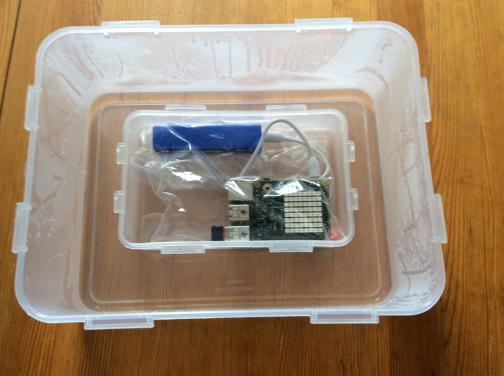
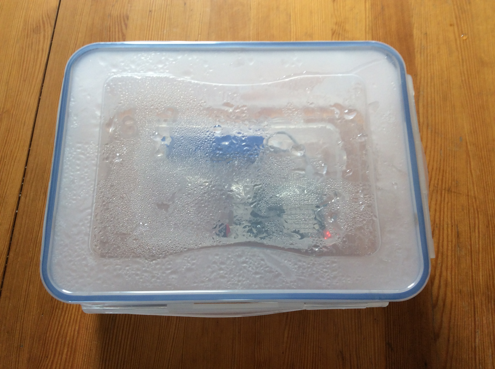
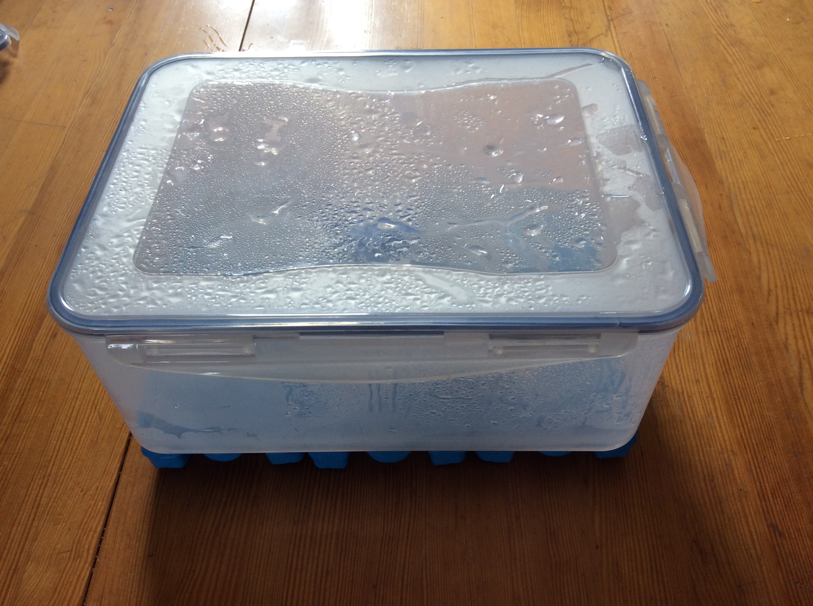
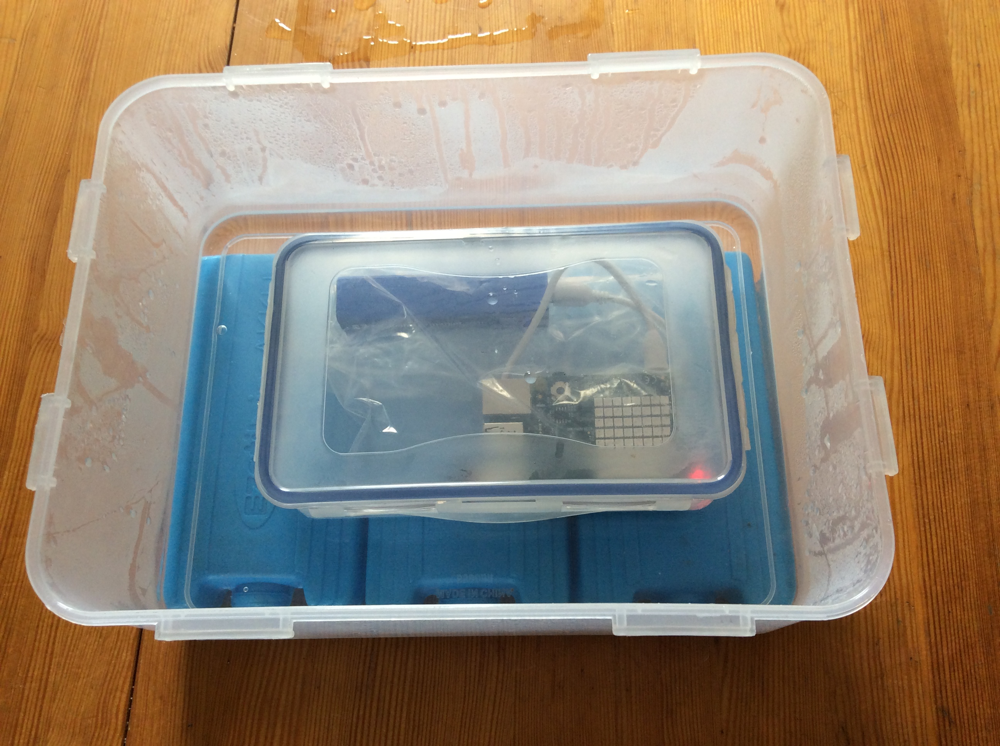

# Lesson 3 - Under Pressure

In this lesson, students will learn about air pressure, and the need to keep the ISS pressurised so that the astronauts are able to breathe.

## Learning objectives

- Understand that there is no air in space, and that this is called a vacuum.
- Understand that air can push against the sides of a container, and that this is called air pressure.

## Learning outcomes

### All students are able to

- Plot simple pressure graphs using the Sense HAT.
- Explain the need to keep air pressure constant on the ISS.

### Most students are able to

- Make predictions regarding changing external pressures on a sealed container.
- Explain the effect of a hull breach on the ISS.

### Some students are able to

- Describe how the air pressure is the results of particles colliding with the walls of a container.

## Lesson Summary

- Students will learn about the vacuum of space, and how the ISS needs to be pressurised to prevent loss of air.
- Students will learn, by conducting experiments with the Sense HAT and pressurised containers, how you need an air-tight seal to maintain air pressure, and that a break in the seal can cause pressure loss.

## Starter

1. Ask students what things an astronaut needs to survive in space. e.g.
    - Food
    - Water
    - Air

1. Ask the students how they think these essentials get to the ISS and how they are kept there.

## Main development

### Explaining air pressure

1. Blow up a balloon, and ask students to explain why the balloon stays inflated. 

1. Allow the balloon to deflate and then use a pin to make a small hole in the skin of the balloon and then try to inflate it again.

1. Ask the students why the balloon deflates.

### Simulating a vacuum

1. Explain that there is no air in space, and that this is known as a vacuum.

1. Ask your students how we might go about producing a vacuum (or an area of very low pressure) on Earth, to simulate the vacuum of space.

1. This time you're going to be measuring air-pressure using the Sense-Logger.py file. Edit the opening lines as shown below.

```python
## Logging Settings
TEMPERATURE=False
HUMIDITY=False
PRESSURE=True
ORIENTATION=False
ACCELERATION=False
MAG=False
GYRO=False
DELAY = 5
BASENAME = "press"
```
1. You can also change the lines that made the LEDs come on in the last lesson

```python
def show_state(logging):
	if logging:
		#sense.clear(255,255,255)
		sense.show_letter("!",text_colour=[0,255,0])
	else:
		sense.show_letter("!",text_colour=[255,0,0])
```

1. Start logging and seal the Raspberry Pi, Sense Hat and battery in a zip-lock bag, then place it on a platform inside a plastic container, as shown below.


1. Place about half a centimeter of boiling water into the base of the container.



1. Ask the students what is filling the space above the water. Try and get them to realise that it is mostly water vapour and steam.

1. Push the lid in place, and ask if air can get back into the container.



1. Ask what will happen to the steam in the container, as it cools.
1. To speed up the condensation of water vapour, you can sit the plastic container on freezer blocks.



1. After 5 minutes, remove the Raspberry Pi from the container and then allow the students to analyse the CSV data as they did in the previous lesson.

1. They should see a gradual decrease in pressure.

### Keeping the ISS pressurised.

1. Explain that now we know how to create a low pressure environment, we can
simulate the Cupola.

2. Start logging and seal your Raspberry Pi and Sense HAT inside a smaller plastic container.



3. Now repeat the previous experiment, to allow the students to see how the sealed container reduces the air pressure loss. If your container has an absolutely air-tight seal, you should see no pressure loss, but this can be difficult to reproduce.

4. The worksheet has students compare the exposed and pressurised pressure graphs. You would normally expect to see a loss in pressure, even from the sealed container unless the seal is perfect. This can lead to a discussion of structual leakage aboard the ISS, which is a real problem.

## Plenary

Ask students to describe what they think would happen to the ISS if a small piece of space debris punctured the hull of the station. If you don't mind losing a container, you could use a hot needle to puncture a hole in the tupperware container.

## Extension

Ask students to research how pressure is maintianed on the ISS and any measures they have to protect against a hull breech. 
