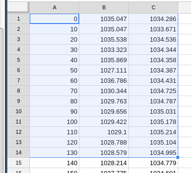

# Lesson 3 - Under Pressure

In this lesson you will be learning the importance of maintaining a positive air pressure aboard the ISS.

## First step

1. Air pressure is caused by the tiny particles of air, moving around and hitting surfaces.

1. If you imagine a sealed box on Earth containing nothing but air, the air particles on the inside of the box are hitting the walls of the box. This pushes the walls outwards.

1. Because the box is on Earth, there is air on the outside, also hitting the outer walls of the box and pushing them inwards.

1. The force of these air particles striking the inside and outside of the box are called Air Pressure. 

1. Your teacher is going to show you an experiment, using the Raspberry Pi and a Sense HAT to measure air pressure.

## Second step

1. Just as you did in the previous lesson, download and graph the csv data produced by the Raspberry Pi and Sense HAT.

1. In your own words, try to describe what is happening to the air pressure as time increases.
		
## Third step

1. Now you've seen what it looks like when there is a drop in pressure, let's see if it's possible to protect from pressure loss.

1. Your teacher is going to repeat the experiment, but this time the Raspberry Pi and Sense HAT are going to be sealed inside another container, which will contain air.

1. Once the experiment has been run, grab the csv data and then add it to the spreadsheet from earlier.

1. You can now create a graph showing the unprotected and protected Raspberry Pi, by selecting all three columns to graph.

